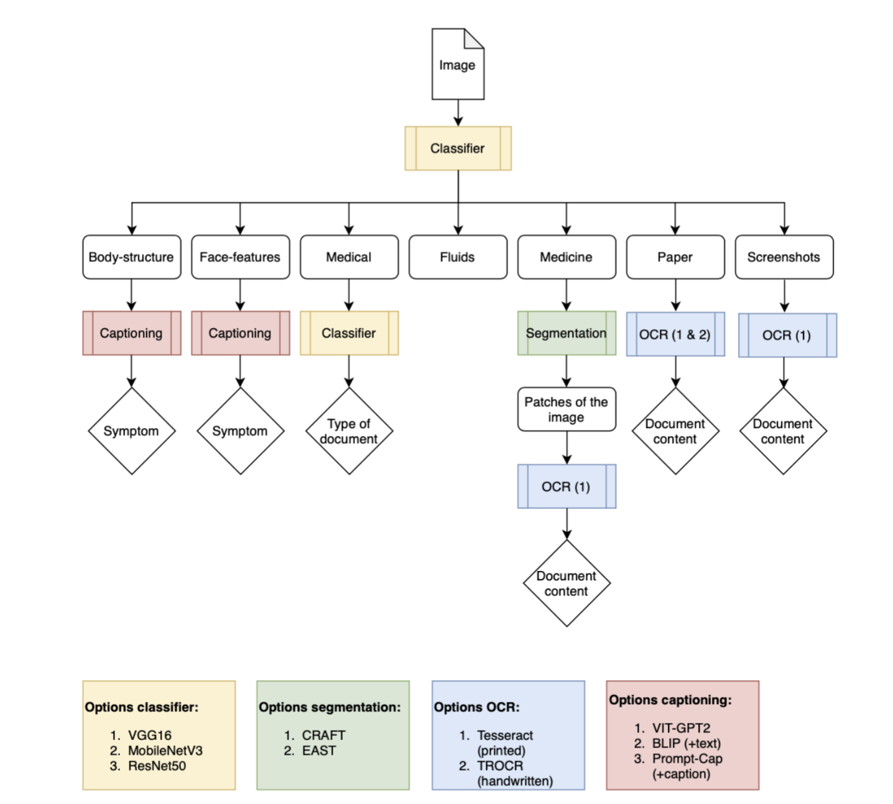
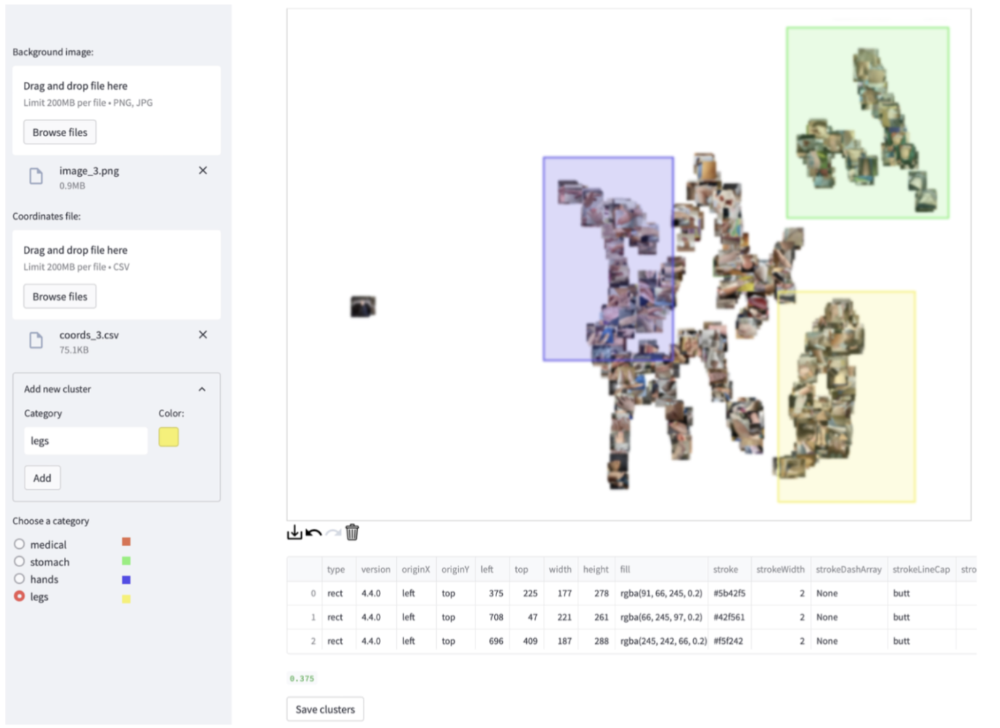
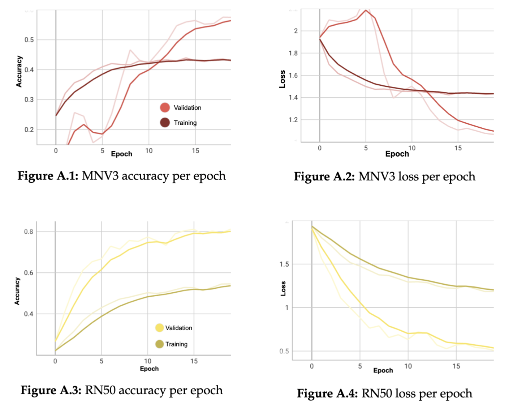
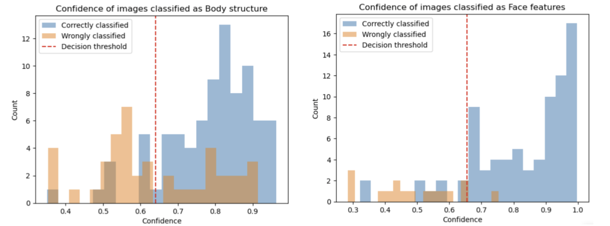
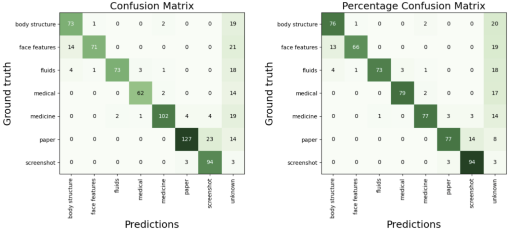
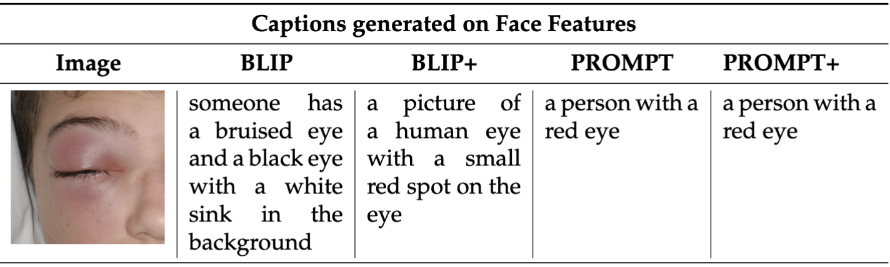
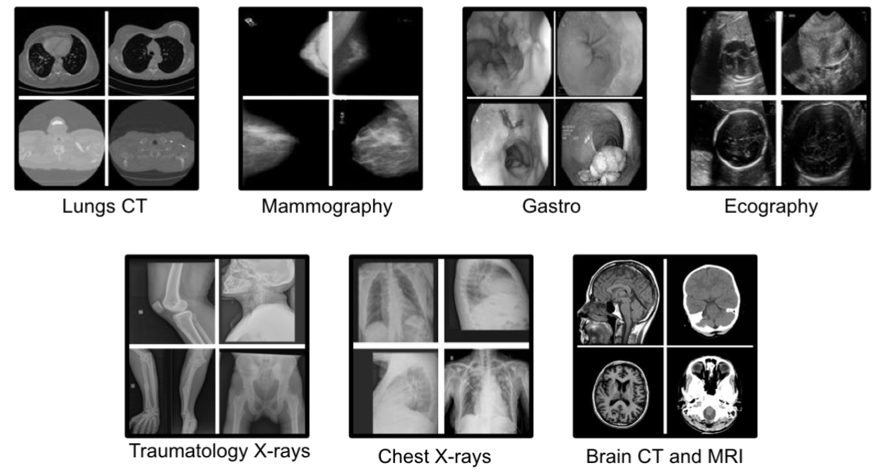
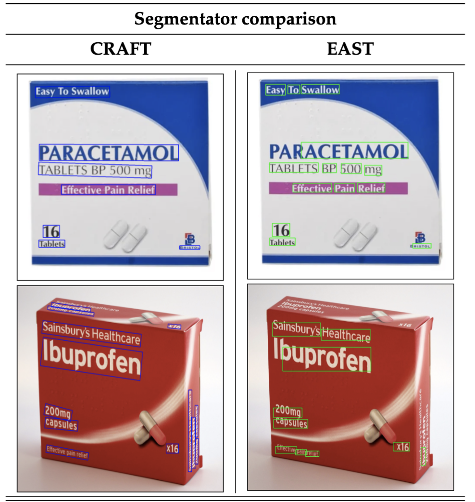
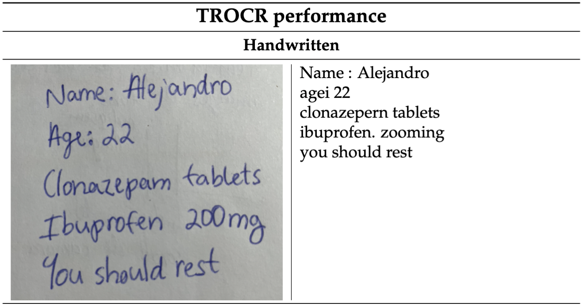

# Medical Image Pipeline

This repository contains the results of my bachelor thesis conducted for [AbiGlobalHealth](https://www.abiglobalhealth.com), focusing on extracting information from images sent by users of their telemedicine service.

**IMPORTANT:** All images used in this thesis are sourced from Google and public datasets to ensure GDPR compliance. No patient images are included.

---

## Overview

The pipeline processes images and automatically routes them to specialized engines based on their type. It combines classification, captioning, segmentation, and OCR to handle a wide variety of image types, including clinical photos, medical documents, and screenshots.

### Pipeline Architecture

    

---

## Components

### 1. Global Classifier

A fine-tuned ResNet50 classifier categorizes images into seven classes: body-structure, face-features, medical documents, fluids, medicine packaging, paper documents, and screenshots. The dataset was labeled using a custom-built annotation platform.

    

Validation curves for different classifiers investigated in this step are shown below:

    

Decision thresholds for the classifier were determined based on model confidence:

    

Results for the classification step:

    

---

### 2. Branch-and-Process

Once classified, images are processed by specialized backends:

#### Body-structure & Face-features

Captioning models (e.g., ViT-GPT2, BLIP) generate natural-language descriptions of visible signs.

    

#### Medical Documents

A secondary classifier identifies document subtypes (e.g., radiographies, MRIs).

    

#### Medicine Packaging

Text segmentation models (e.g., CRAFT, EAST) isolate regions of interest, which are processed by OCR engines (e.g., Tesseract, TrOCR) to extract text.

    

#### Paper Documents

Direct OCR extracts text from printed or handwritten documents.

    

#### Screenshots

OCR extracts on-screen text from digital screenshots.

---

## Conclusion

This pipeline integrates classification, captioning, segmentation, and OCR to process diverse image types in a unified framework. It can handle clinical photos, digitize medical documents, and extract text from screenshots efficiently.

For more details, refer to the thesis PDF: [Information Extraction from Telemedicine Consultation Images](information_extraction_from_telemedicine_consulation_images.pdf).
